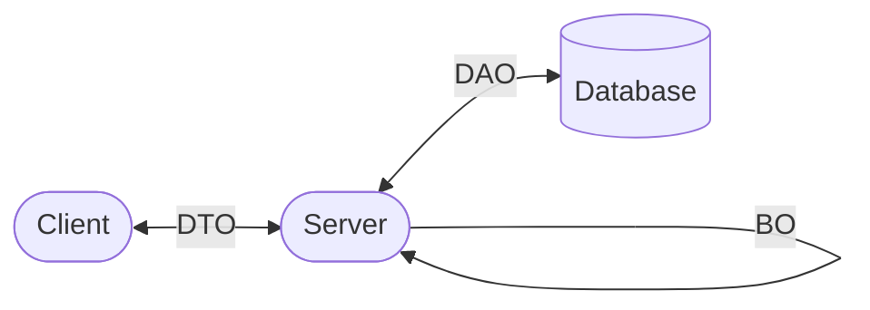

# Model 建立指引

資料是軟體的基本，定義Model的方式決定開發的能不能符合專案的實際需要，下面將介紹Model的設計步驟

1. 根據 ui flow 訂出需要呈現的資料

2. 需要列出 use case，以確保儲存資料可以符合期望
   
   - `我是＿，進行＿，以達到＿得效果`，(user, action, result)

3. 根據頁面與區塊可以開始定出Entity，這裡的Entity沒有特定意義，就是欄位的集合。不需要一開始便設計出ER Model，雖然這終究是我們最終目標的產物

4. 了解業務的同時，便可以開始設計出有層級有意義的Entity

5. Entity有很廣的意思，我們可以把它細分
   
   1. DAO 與資料表對應的物件
   
   2. DTO 與前端溝通的物件 (可以再細分成XxxReq, XxxRes)
   
   3. BO 商業邏輯需要的物件 (通常用DAO即可)



5. 為避免欄位過多導致雜亂，以及有效的避免重複定義，我會使用Type的方式來定義API Response (DTO Res)
   
   ```js
   Todo {
       id: number,
       state: 'todo' | 'doing' | 'done',
       text: string
   }  
   ```

步驟